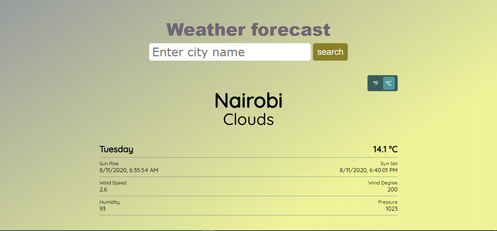

## Js-Weather-app
js-the-weather-app is a simple javascript application that consults the Open Weather API and shows you the information about the weather of the location you query.

## Live
[weather](https://zealous-cori-c9e374.netlify.app/)

## Screenshot

1. Main

## features
- use of promise, asynch and await.
- fetch api to request data from openweathermap api
- conversion from farenheit to celsius
- Error handling

## Built With
- Javascript
- Bootstrap
- Webpack
- Webpack modules

## Authors

👤 **Hillarioh Okerio**

- Github: [@hillarioh](https://github.com/hillarioh)
- Twitter: [@hillaokri](https://twitter.com/hillaokri)
- Linkedin: [Hillarioh Okerio](www.linkedin.com/in/hillaryokerio)
- Email: (okerioh@gmail.com)

## 🤝 Contributing

Contributions, issues and feature requests are welcome!

## Show your support

Give a ⭐️ if you like this project!

## 📝 License

This project is [MIT](./LICENSE) licensed.
